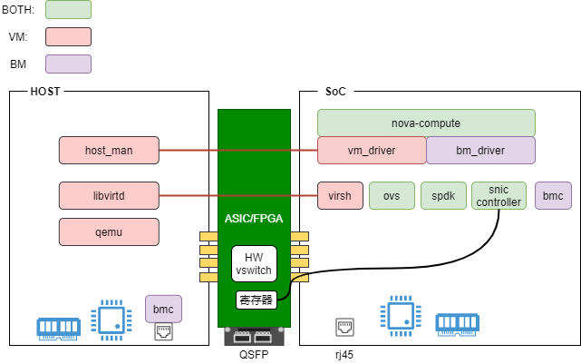

# DPU使用场景及接口(待完善)

1. [云计算场景描述](#scenarios)
    1. [BM场景](#bm_scenario)
    1. [VM场景](#vm_scenario)
1. [组件接口](#apis)
    1. [nova-compute对上接口](#nova_compute_apis)
    1. [snic-controller对上接口](#snic_apis)
    1. [ovs对上接口](#ovs_apis)
    1. [bmc对上接口](#bmc_apis)

--------

该文档描述DPU的云计算应用场景（不全面，待补充），并描述为了实现这些场景各个组件需要提供的接口能力。根据要提供的接口能力整理出这些应用场景下对DPU的需求点。(`DPU_VM`=VM场景的需求，`DPU_BM`=BM场景的需求，`DPU_BOTH`=两种场景共同需求)



## 云计算场景描述 <a name="scenarios"></a>
--------

### BM场景 <a name="bm_scenario"></a>

节点加入集群：
1. soc上电启动（但host不启动？）
1. soc启动nova-compute服务，通过bm_driver调用接口(bmc?)获取宿主机硬件信息上报给nova controller。该步骤把soc注册到nova controller成为一个新的节点。

创建裸金属实例：
1. 当用户请求创建一个BM且规格匹配的情况下，nova controller会调度到该节点。具体创建工作在bm_driver内完成。
1. 如果用户提供的是一个image而不是volume，则bm_driver调用cinder接口创建一个volume(source from image)。**（不支持本地系统盘）**
1. bm_driver调用snic controller创建一个或多个PF，用来为host提供块存储设备。PF在soc有一个representor，bm_driver继续把representor和spdk进行绑定，使其和后端存储集群打通。这时相当于系统盘已经挂到了服务器上。PF representor和后端volume的绑定关系需要记录，以便查询/重建/卸载时使用
1. bm_driver调用snic controller创建一个或者多个PF，用来为host提供网卡设备。每个PF在soc有一个representor，bm_driver把representor加入到ovs桥，并通过external_id注明其对应的neutron port. openflow控制器可以根据external_id下发正确的流表。representor和neutron port对应关系需要记录(neutron port bonding_profile? or local db?)
1. bm_driver调用接口(bmc?)对host执行开机操作
1. bm_driver在soc本地记录该节点已经部署实例及实例id
1. host寻找到启动盘执行启动，启动过程通过dhcp获取到网卡ip地址。cloud-init通过网络获取实例metadata，并在本地进行配置, 比如 hostname，password，或者执行用户自定义脚本，等等

动态添加网卡：
1. 用户请求添加一个网卡，nova controller知道用户请求的instance在哪个节点上。然后会通知nova-compute添加网卡
2. 类似于创建流程，bm_driver会创建一个PF并把representor加入ovs桥

动态删除网卡：
1. 用户请求删除指定网卡，请求会下发到nova-compute
1. bm_driver找到网卡id找到对应的representor（通过external_id），然后把representor从ovs桥detach。然后调用snic controller把对应的PF删掉

动态添加云盘：
1. 用户请求挂载一个volume，请求会下发到nova-compute
1. bm_driver创建一个PF，并把representor和spdk绑定以连接到存储volume

动态删除云盘：
1. 用户请求删除指定volume，请求下发到nova-compute
1. bm_driver根据volume id找到对应的PF。然后detach from spdk并调研nic controller删除PF

裸金属console访问：
1. nova-compute把host bmc的console接口转给云平台，以此来暴露裸金属的console

裸金属关机：
1. 客户通过云平台(bmc)或者裸金属内部支持shutdown可以关机裸金属
1. 此时soc仍然处于运行状态，之前创建的PF也都存在

裸金属开机：
1. 用户在关机裸金属后可以通过云平台对裸金属执行开机操作
1. 由于磁盘网络等设备都存在，host通过磁盘直接启动

删除裸金属实例：
1. 用户请求销毁实例，请求下发到nova-compute。nova-compute确认该实例存在于本节点
1. bm_driver把所有网卡从ovs detach，并调用snic controller删除PF。同时把所有云盘从spdk detach，并调用snic controller删除PF

### VM场景  <a name="vm_scenario"></a>

节点加入集群：
1. 服务器上电，soc启动，host启动
1. soc启动nova-compute服务，vm_driver通过和host_man(as simple as ssh?)组件交互获取host资源信息上报nova controller。该步骤把soc注册到nova controller成为一个新的节点。

创建虚机实例：
1. 用户发起创建虚机请求，云平台根据用户提供的规格信息将虚机调度到一台节点。请求下发到nova-compute
1. vm_driver根据从host_man获取到的资源情况(numa, cpu, mem)等信息决定虚机的cpu，mem分配。并生成libvirt xml片段
1. 如果用户提供的是一个image而不是volume，则vm_driver调用cinder接口创建一个volume(source from image)。
1. vm_driver调用snic controller创建一个或多个PF，用来为虚机提供块存储设备。PF在soc有一个representor，vm_driver继续把representor和spdk进行绑定，使其和后端存储集群打通。这时磁盘在host已经可见。创建PF的时候会返回PF在host的bdf id，vm_driver根据bdf id生成libvirt xml片段的使得PF透传给虚拟机(如何考虑热迁移？)
1. vm_driver调用snic controller创建一个或者多个PF，用来为虚机提供网卡设备。每个PF在soc有一个representor，vm_driver把representor加入到ovs桥，并通过external_id注明其对应的neutron port. vm_driver根据PF的bdf id生成libvirt xml片段使得PF透传给虚机(vDPA?)
1. vm_driver根据libvirt xml片段组合成完整虚机xml，然后通过libvirt创建虚机并启动。同时nova-compute向nova-controller上报status表明最新的资源使用情况。
1. 虚机image已经在volume中，虚机启动image的系统，启动过程cloud-init通过网络获取metadata并完成配置

虚机动态增删 网卡/云盘：
1. 参考裸金属网卡/云盘增删流程和虚机实例创建流程

虚机关机：
1. 用户执行虚机关机，对应qemu进程结束。（透传给虚机的的设备不从soc detach？）

虚机冷迁移：
1. 用户发起虚机冷迁移。nova-controller检查目标节点资源情况
1. 通知源节点对虚机执行关机操作
1. 在目标节点按创建虚机流程创建实例。此时网卡和磁盘设备在目标节点也attach(磁盘支持在两个节点同时attach？)。并更新neutron port的binding host信息。
1. 通知源节点detach 云盘、网卡设备

裸金属->虚机冷迁移：
1. 用户发起冷迁移操作，并指定新的flavor(裸金属迁移到虚机通常涉及flavor变小？). nova-controller检查目标节点的资源情况
1. 通知源节点对裸金属执行关机操作
1. 在目标节点按创建虚机流程创建实例。此时网卡和磁盘设备在目标节点也attach(磁盘支持在两个节点同时attach？)。并更新neutron port的binding host信息。
1. 通知源节点detach 云盘、网卡设备

虚机->裸金属迁移：
1. 参考裸金属迁移到虚机流程

虚机热迁移：
1. 待补充

## 组件接口  <a name="apis"></a>
-----

### nova-compute对上接口  <a name="nova_compute_apis"></a>

1. report_node_status\
    nova-compute向云平台上报节点状态信息。\
    DPU_BOTH: soc有独立管理网卡用于和云平台控制面交互。
    ```yaml
    # soc的hostname，用于调度器区分不同节点。和非DPU场景下计算节点的hostname有同样意义
    hostname: compute-node-xx

    # 该节点是否准备好被调度，用于创建VM/BM
    ready: yes

    # 节点类型，BM或者VM
    node_type: BM

    # 不通的DPU功能可能有差异，云平台可能需要根据不同网卡走不同处理逻辑
    #   - DPU_BOTH: soc获取DPU型号
    DPU_model: BF2

    # 该节点总的cpu资源量。
    #   - DPU_BM: soc获取host的cpu/mem等硬件信息。如通过bmc
    #   - DPU_VM: soc获取host上分配给虚机的硬件资源信息。如通过host上的agent
    total_cpu: 64

    # 该节点上cpu资源的使用量
    #   - DPU_VM: soc获取host上虚机硬件资源使用情况。如通过host上的agent
    used_cpu: 10

    total_mem: 512
    used_mem: 100
    instances:
        - uuid: instance-uuid
          status: up/down/error
          todo: other_info?
    ```

1. build_and_run_instance

    ```yaml
    name: instance-1

    # 实例镜像，镜像名字或者镜像在存储的uri
    #   DPU_BOTH: soc能和后端存储通信，且能支持存储能力卸载到硬件，如rdma
    #   DPU_BOTH: soc能为host创建磁盘设备，后端为云存储
    image: centos_image_uuid

    # 实例启动过程cloud-init通过metadata server获取userdata
    userdata: {admin_pass: xxx}

    flavor: 4c8g

    # DPU_BOTH: 支持动态创建 PF/VF
    networks:
        - subnet: net1
          mac: aa:bb:cc:dd:ee:ff
    volumes:
        - volume_id: uuid
          # 通常用来指定系统盘
          # DPU_BM(low priority): bmc支持配置从特定磁盘(bdf)启动
          bootable: yes/no
    ```

1. create_snapshot\
    DPU_BOTH: 在磁盘被访问的情况下支持创建快照
    ```yaml
    instance: uuid
    volume: uuid
    ```

1. pause_vm/uuid

1. stop_instance/uuid

1. start_instance/uuid

1. reboot_instance
    ```yaml
    instance: uuid
    # DPU_BM: bmc支持对host软/硬重启
    type: hard/soft
    ```

1. resize_vm
    ```yaml
    instance: uuid
    new_flavor: flavor_id
    ```

1. get_instance_console/uuid

1. reset_instance_admin_password
    ```yaml
    instance: uuid
    # DPU_BM(medium priority): 裸金属重置root密码(通过修改云盘数据？)
    new_password: pwd(encrypted?)
    ```


### snic-controller对上接口 <a name="snic_apis"></a>

1. create_pf/create_vf
    - request:
        ```yaml
        # specify id or index
        # <optional>
        id: xxx

        # PF/VF mac address
        # <optional>
        # DPU_BOTH: 创建PF/VF可以指定mac
        mac: aa-bb-cc-dd-ee-ff

        # 指定要创建PF还是VF
        type: PF

        # pf features enabled, i.e. tso
        # <optional>
        features: 
        ```
    - response:
        ```yaml
        id: xxx
        mac: aa-bb-cc-dd-ee-ff

        # PF/VF在host上的bdf号，用来返回给云平台以展示给用户
        # DPU_BOTH: soc上能查询到PF/VF在host上对应的bdf号
        # DPU_BM: soc重启后重建之前创建的PF/VF需要保证重建的bdf id一致，比如通过创建时传入同样的id
        bdf: 0000:xx:xx.x

        # <optional>
        features:

        type: PF

        # representor identity, i.e. representor interface name or an id
        representor: xxx
        ```

1. create_storage_dev

1. get_pf/get_vf
    - request:
        ```yaml
        id: xxx
        ```
    - response:
        ```yaml
        id: xxx
        mac: aa-bb-cc-dd-ee-ff
        bdf: 0000:xx:xx.x
        features:
        type: PF
        representor: xxx
        ```

1. delete_pf/delete_vf
    - request:
        ```yaml
        id: xxx
        ```

### ovs对上接口 <a name="ovs_apis"></a>

1. add_port
    ```yaml
    bridge: br-int

    # port name, 或者是representor或者是云平台生成的一个name
    port_name: name

    external_id: port_uuid
    pf_id: id_of_pf
    ```

1. del_port
    ```yaml
    bridge: br-int
    port_name: name
    ```

### bmc对上接口 <a name="bmc_apis"></a>

1. power_on/power_off\
    DPU_BM: soc能访问host bmc
    ```yaml
    ip: aaa.bbb.ccc.ddd
    auth: userpassword
    ```

1. get_hw_info
    - request:
        ```yaml
        ip: aaa.bbb.ccc.ddd
        auth: userpassword
        ```
    - response:
        ```yaml
        series_number: snxxxx
        cpu: xxx
        mem: xxx
        todo: 待完善
        ```

1. console access\
    DPU_BM: 可能需要把host bios配置界面暴露给客户，bios配置改动不能对soc造成不好影响


## 网络数据面能力

1. set_interface_qos\
    DPU_BOTH: 支持实例网卡 qos
    ```yaml
    interface: port_uuid
    pps: xxx
    bps: xxx
    ```

1. tunnel\
    DPU_BOTH: 支持tunnl(vxlan? geneve?)

1. conntrack\
    DPU_BOTH: 支持conntrack