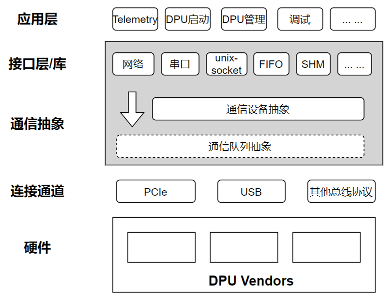

# Proposal：DPU通信及管理组件接口设计（draft）

## 目标

为不同的DPU产品提供硬件无关的软件管理平台及工具，统一使用接口及命令，构建通用的DPU管理生态。

## 架构

通过简单的层级结构，屏蔽底层硬件接口差异及上层应用多样性：

* 不同DPU硬件与HOST使用不同的总线协议连接，由上图硬件层和连接通道层表示
* 不同类型的连接总线可能具备相同的通信队列，通过通信队列抽象简化同类型连接总线开发难度
* 通信设备抽象不区分底层连接协议，对上提供统一的通信设备接口抽象及使用接口
* 通信队列抽象和通信设备抽象合并组成通信抽象层，屏蔽底层硬件差异，对上层OS提供统一的通信设备模型及接口
* 接口层/库使用通信设备及其提供的接口函数，封装成OS常见的通信方式，包括网络、串口、unix-socket、FIFO、共享内存SHM等跨HOST-DPU通信通道。
* 应用层使用接口层/库提供的跨HOST-DPU通信接口，实现用户自定义DPU管理功能，包括Telemetry、DPU启动、管理、调试等功能组件，应用功能用户可自定义。sig可提供部分典型应用。
* 通信抽象层和接口层为sig重点涉及内容，为上层应用提供平台及机制，具体使用方式和策略由上层应用决定。

## 通信抽象层

### 通信队列抽象

通信队列抽象根据连接总线协议确定，本方案提供一个简单参考，如有必要可进一步补充：

*消息通信队列*：每个队列可实现可靠的跨HOST-DPU消息传输，队列建议为单向传输，通信设备可以包含多个队列，可分为发送队列和接受队列，通信的两端设备的发送/接受队列互连（一端发送队列与另一端接受队列直连），形成通信回环。队列包含以下接口函数：

* queue_init： 消息队列创建
* queue_destroy: 消息队列销毁
* write：向队列写入数据
* read：从队列读出数据
* kick：通知对端有数据写入，或其他事件
* is_full: 队列检查，是否已满
* is_empty: 队列检查，是否为空

每个队列还可以维护自己的私有数据结构体priv_data，用来保存队列初始化的相关信息，以及与对端进行通信协商。

私有信息协商内容：

* 消息体大小
* 队列长度
* 消息属性，大小端类型等

消息通信队列实现需要屏蔽消息体底层差异，如进行消息拆分、拼接，大小端类型转换等。对上层设备或应用提供统一的标准消息格式。

> 不同的连接总线协议可以有不同队列抽象

### 通信设备抽象

通信设备给予通信队列构建一个跨HOST-DPU通信设备，该设备接口统一，与底层通信队列及连接通道无关。

提供设备注册及解绑接口函数，通过初始化创建设备，并注册给系统使用：

* register_dpu_comm_dev: 注册HOST-DPU通信设备
* unregister_dpu_comm_dev: 解绑HOST-DPU通信设备

通信设备由用户自定义初始化，可以通过私有数据结构priv_data记录设备自有信息，并提供以下几个操作接口函数集合：

* xmit_ops
  * dev_init: 通信设备初始化0
  * open: 设备打开，完成准备动作
  * close： 设备关闭
  * xmit： 消息发送接口函数
  * rx： 消息接受接口函数
* mgnt_ops:
  * set_attr: 修改设备指定属性为指定值
  * get_attr: 查询设备指定属性
  * get_status： 查询设备状态，用于维测

## 接口层/库

基于linux内核标准接口实现网络、串口、unix-socket、FIFO、共享内存SHM等标准通信接口，实现跨HOST-DPU通信机制，上层应用可选择合适的通信接口实现自己的功能。

* 网络：跨HOST-DPU的虚拟网卡对，可通过指定IP访问DPU上虚拟网卡。
* 串口：跨HOST-DPU的虚拟串口实现，可通过主机指定tty设备访问DPU虚拟串口。
* FIFO：跨HOST-DPU的FIFO通信，主机和DPU可通过具名pipe直接通信，常用IPC通信手段
* unix-socket：跨HOST-DPU unix-socket通信，主机和DPU进程可通过监听相互关联的unix-socket文件进行socket通信，常用IPC通信手段。
* 共享内存：软件实现的虚拟共享内存方案，实现跨HOST-DPU进程间的共享内存通信（性能可能会受影响），常用IPC通信手段。
