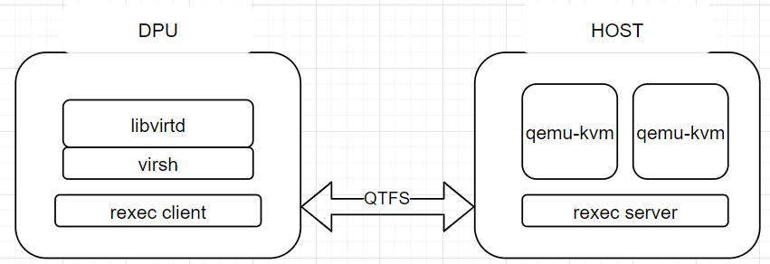

# **1** 硬件准备

## 测试模式

需准备2台物理机（虚拟机当前未试过），网络互通。

其中一台作为DPU模拟，另一台作为HOST模拟。在本文档中用DPU和HOST指代这两台服务器。

> **说明：**
>测试模式因为会暴露网络端口且不做连接认证，存在网络安全风险，仅能用于内部测试验证，不要用于实际生产环境。
>实际生产环境中应使用封闭通信方式，以防止外界连接风险，如下述vsock通信模式。

## vsock模式

需要DPU加HOST，且DPU能支持通过virtio提供vsock通信方式。

文档当前仅描述基于测试模式的方法，下面的内容依然默认使用测试模式。如果验证环境支持vsock通信（虚拟化环境或支持vsock的DPU-HOST环境），下述测试步骤仍适用，只需要将测试中的IP网络地址修改为vsock cid即可（相关二进制编译过程也无需使用TEST_MODE）。

# **2** libvirt卸载架构图



# **3** 环境搭建

## **3.1** qtfs文件系统部署

可参考qtfs主页：<https://gitee.com/openeuler/dpu-utilities/tree/master/qtfs>

qtfs建联需要关闭DPU和HOST侧的防火墙，或在防火墙中开放相关网络端口号。

## **3.2** UDSPROXYD服务部署

### 3.2.1 简介

udsproxyd是一个跨主机的unix domain socket代理服务，需要分别部署在HOST和DPU上，在HOST和DPU上的udsproxyd组件是对等的关系，可以实现分布在HOST与DPU上的2个进程之间的uds通信，通信进程是无感的，也就是说如果这两个进程在同一主机内通过uds正常通信的功能，拉远到HOST和DPU之间也可以，不需要做代码适配，只需要作为client的一端加一个环境变量`LD_PRELOAD=libudsproxy.so`。udsproxyd作为一个跨主机的unix socket服务，本身可以用LD_PRELOAD=libudsproxy.so的方式对接使用，在qtfs的支持下也可以无感应用，这需要提前做好白名单相关配置，具体有两种方式，将在后面详述。

### 3.2.2 部署方式

首先，在dpu-utilities工程内编译udsproxyd：

```bash
cd qtfs/ipc

make -j UDS_TEST_MODE=1 && make install
```
>如果使用vsock模式，编译时不需要设置UDS_TEST_MODE。

当前最新版本下，qtfs server侧的engine服务已经整合了udsproxyd的能力，所以server侧若部署了qtfs后不需要再额外启动udsproxyd。client侧则单独拉起udsproxyd服务：

```bash
nohup /usr/bin/udsproxyd <thread num> <addr> <port> <peer addr> <peer port> 2>&1 &
```

参数解释：

```bash
thread num: 线程数量，目前只支持单线程，填1

addr: 本机使用的ip，如果使用vsock通信模式则为cid

port：本机占用的port

peer addr: udsproxyd对端的ip，如果使用vsock模式则为cid

peer port: 对端port
```

示例：

```bash
nohup /usr/bin/udsproxyd 1 192.168.10.10 12121 192.168.10.11 12121 2>&1 &
```

如果未拉起qtfs的engine服务，想单独测试udsproxyd，则在server端也对等拉起udsproxyd即可：

```bash
nohup /usr/bin/udsproxyd 1 192.168.10.11 12121 192.168.10.10 12121 2>&1 &
```

### 3.2.3 应用方式

#### 3.2.3.1 独立使用udsproxyd服务

需要在使用uds服务的unix socket应用程序的client端进程启动时添加LD_PRELOAD=libudsproxy.so环境变量，以接管glibc的connect api进行uds对接，在libvirt卸载场景中可以将libudsproxy.so拷贝到libvirt的chroot目录下的/usr/lib64中以提供给libvirtd服务使用，这一步在后面介绍。

#### 3.2.3.2 无感使用udsproxyd服务

首先为qtfs配置uds服务的白名单，这里说的白名单是unix socket的server端bind的sock文件地址，例如libvirt的虚拟机建立的unix socket的服务端文件地址都在/var/lib/libvirt下，则我们需要增加一条白名单路径为/var/lib/libvirt/，提供两种方式供选择：

* 通过配置工具qtcfg加载，进入qtfs/qtinfo目录编译工具：

在qtfs的client端执行

```bash
make role=client 
make install
```
在qtfs的server端执行

```bash
make role=server
make install
```
配置工具将会自动安装，然后使用qtcfg命令配置白名单，假设需要增加的白名单为"/var/lib/libvirt/"，输入：

```bash
qtcfg -w udsconnect -x /var/lib/libvirt/
```
查询白名单为：

```bash
qtcfg -w udsconnect -z
```
删除白名单为:

```bash
qtcfg -w udsconnect -y 0
```
删除白名单时，参数为查询白名单时列出来的index序号。

* 通过配置文件增加，这需要在qtfs或qtfs_server内核模块加载前配置，通过内核模块初始化时读取该文件进行白名单配置。

> **说明：**
>白名单是为了防止不相干的unix socket链接也进行远程连接产生错误，或者浪费不必要的资源，所以白名单尽量设置得精确一些，比如本文中针对libvirt场景设置为/var/lib/libvirt/比较好，而直接将/var/lib/或/var/或直接将根目录加入的做法是有较大风险的。

## **3.3** REXEC服务部署

### 3.3.1 简介

rexec是一个用c语言开发的远程执行组件，分为rexec client和rexec server。server端为一个常驻服务进程，client端为一个二进制文件，client端被执行后会基于udsproxyd服务与server端建立uds连接，并由server常驻进程在server端拉起指定程序。在libvirt虚拟化卸载中，libvirtd卸载到DPU上，当它需要在HOST拉起虚拟机qemu进程时调用rexec client进行远程拉起。

### 3.3.2 部署方法

#### 3.3.2.1 配置环境变量与白名单

在HOST侧配置rexec server的白名单，将文件whitelist放置在/etc/rexec/目录下并修改权限为只读：

```bash
chmod 400 /etc/rexec/whitelist
```
如果想仅用于测试，可以不进行白名单配置，删除此文件重启rexec_server进程后则没有白名单限制。

下载dpu-utilities代码后，进入qtfs/rexec主目录下，执行：`make && make install`即可安装rexec所需全部二进制到/usr/bin目录下，包括了：`rexec、rexec_server`两个二进制可执行文件。

在server端启动rexec_server服务之前，检查是否存在/var/run/rexec目录，没有则创建：

```bash
mkdir /var/run/rexec
```

rexec服务运行时底层通信使用unix socket，因此跨主机的rexec和rexec_server通信依赖上述udsproxyd服务，并且需要在udsproxy中添加相关白名单：
```bash
qtcfg -w udsconnect -x /var/run/rexec
```

#### 3.3.2.2 服务方式

server端可以通过两种方式拉起rexec_server服务。

- 方式1:
配置systemd服务

在/usr/lib/systemd/system/下增加rexec.service文件，内容如下：

[rexec.service](./config/rexec.service)

然后通过systemctl管理rexec服务。

首次配置服务时：

```bash
systemctl daemon-reload

systemctl enable --now rexec
```


后续重启新启动服务：

```bash
systemctl stop rexec

systemctl start rexec
```

- 方式2:
手动后台拉起

```bash
nohup /usr/bin/rexec_server 2>&1 &
```

## **3.4** libvirt服务部署

### 3.4.1 HOST侧部署

HOST无需额外部署，只需要安装虚拟机启动环境以及libvirt即可（安装libvirt主要是为了创建对应的目录）：

```bash
yum install -y qemu libvirt edk2-aarch64 #(arm环境虚拟机启动需要)
```

HOST需要放置虚拟机镜像，后面通过qtfs挂载到client端共享给libvirt。

### 3.4.2 DPU侧部署

#### 3.4.2.1 创建chroot环境

a) 从openEuler官网下载qcow镜像，例如openEuler 22.03 LTS版本：<https://repo.openeuler.org/openEuler-22.03-LTS/virtual_machine_img/>。

b) 将qcow2挂载出来：

```bash
cd /root/

mkdir p2 new_root_origin new_root

modprobe nbd maxport=8

qemu-nbd -c /dev/nbd0 xxx.qcow2

mount /dev/nbd0p2 /root/p2

cp -rf /root/p2/* /root/new_root_origin/

umount /root/p2

qemu-nbd -d /dev/nbd0
```

c) 此时new_root_origin有解压出来的镜像根目录，再将new_root绑定挂载到该目录上，作为chroot的根目录挂载点：

```bash
mount --bind /root/new_root_origin /root/new_root
```

#### 3.4.2.2 安装libvirt
此处介绍patch方式源码编译，如果计算提供rpm包则参考计算提供的安装方法。

a) 进入chroot环境，安装编译环境和常用工具：

```bash
yum groupinstall "Development tools" -y
yum install -y vim meson qemu qemu-img strace edk2-aarch64 tar
```
其中edk2-aarch64是arm环境下虚拟机启动需要的。

b) 安装libvirt编译需要的依赖包：

```bash
yum install -y rpcgen python3-docutils glib2-devel gnutls-devel libxml2-devel libpciaccess-devel libtirpc-devel yajl-devel systemd-devel dmidecode glusterfs-api numactl
```

c) 下载libvirt-6.9.0源码包：<https://libvirt.org/sources/libvirt-6.9.0.tar.xz>。

d) 获取直连聚合libvirt patch：

<https://gitee.com/openeuler/dpu-utilities/tree/master/usecases/transparent-offload/patches/libvirt>。

e) 将源码包解压到chroot环境下的目录，如/home。将patch打上。

f) 进入libvirt-6.9.0目录：

```bash
meson build --prefix=/usr -Ddriver_remote=enabled -Ddriver_network=enabled -Ddriver_qemu=enabled -Dtests=disabled -Ddocs=enabled -Ddriver_libxl=disabled -Ddriver_esx=disabled -Dsecdriver_selinux=disabled -Dselinux=disabled
```

g) 安装成功。

```bash
ninja -C build install
```

#### 3.4.2.3 启动libvirtd服务。

libvirt直连聚合卸载模式，需要从chroot内启动libvirtd服务，首先需要把chroot之外的libvirtd服务停掉。

a) 放置虚拟机跳板脚本在chroot环境下的/usr/bin和/usr/libexec下：[qemu-kvm](./scripts/qemu-kvm)。替换原同名二进制，这个跳板脚本就是用于调用rexec拉起远端虚拟机。
> **说明：**
>virsh使用的xml中，<devices>下面的<emulator>需要填qemu-kvm，如果是填的其他，则需要修改为qemu-kvm，或者将跳板脚本替换<emulator>指代的二进制，且跳板脚本内容需要对应地更改。

b) 将udsproxyd编译时附带产生的libudsproxy.so拷贝到本chroot目录下/usr/lib64下，如果配置qtfs的uds白名单方式使用udsproxyd服务，则不需要。

c) 将前面rexec编译产生的rexec二进制放置到本chroot的/usr/bin/目录下。

d) 配置chroot的挂载环境，需要挂载一些目录，使用如下配置脚本:
- [virt_start.sh](./scripts/virt_start.sh)为配置脚本，virt_start.sh脚本中需要手动修改qtfs ko dir为编译的ko位置，HOST ip address为正确的HOST地址。
- [virt_umount.sh](./scripts/virt_umount.sh)为消除配置脚本。

e) 脚本中挂载目录位置都是按照本文档前文创建目录位置与名称为准，如果有修改需要同步适配修改脚本。

f) 配置好chroot环境后，进入chroot环境，手动拉起libvirtd。

未配置qtfs使用udsproxyd白名单的拉起方式:

```bash
LD_PRELOAD=/usr/lib64/libudsproxy.so virtlogd -d
LD_PRELOAD=/usr/lib64/libudsproxy.so libvirtd -d
````
如果已配置qtfs使用udsproxyd白名单，则不需要增加LD_PRELOAD前缀：

```bash
virtlogd -d
libvirtd -d
```

查看是否已配置白名单的方式，在chroot之外的窗口，执行：

```bash
qtcfg -z
```

查看列举出来的白名单是否包含/var/lib/libvirt/。

## **3.5** 拉起虚拟机

服务部署完成后，即可以在DPU侧进行虚拟机的生命周期管理。

### 3.5.1 虚拟机define

a) 将虚拟机启动镜像放置在HOST侧某目录，例如：

```bash
/home/VMs/Domain_name
```

b) 使用qtfs将这个目录挂载到DPU侧：

```bash
mount -t qtfs /home/VMs /home/VMs
```

c) xml中使用`/home/VMs/Domain_name`作为启动镜像，这样在DPU和HOST侧看到的都是同一个镜像文件（Domain_name是虚拟机domain的名字）。

d) 检查xml中<emulator>是否指向了跳板脚本。

e) 执行。

```bash
virsh define xxx.xml
```

### 3.5.2 虚拟机start

```
virsh start domain
```


# **4** 环境重置

由于libvirt在DPU和HOST之间共享了部分目录，卸载环境时需要先将这部分目录全部umount。一般先停掉libvirtd和virtlogd进程，调用virt_umount脚本即可。如果HOST还有虚拟机运行，也需要先杀掉才能umount。


# **5** 部分问题定位思路

1. libvirt编译失败：检查依赖包安装是否完全，如果chroot挂载了外部目录或者HOST目录，也可能导致编译失败，需先解除挂载。

2. qtfs挂载失败：可能server端engine进程没拉起、防火墙没关导致qtfs建联失败。

3. 虚拟机define失败：检查xml里的项目仿真器是否指向跳板脚本、虚拟机镜像是否已经通过qtfs挂载到DPU上可见，且路径与HOST一致。

4. 虚拟机启动失败：libvirtd和virtlogd服务是否拉起、rexec服务是否拉起、跳板进程是否拉起、是否qemu-kvm拉起时报错。
