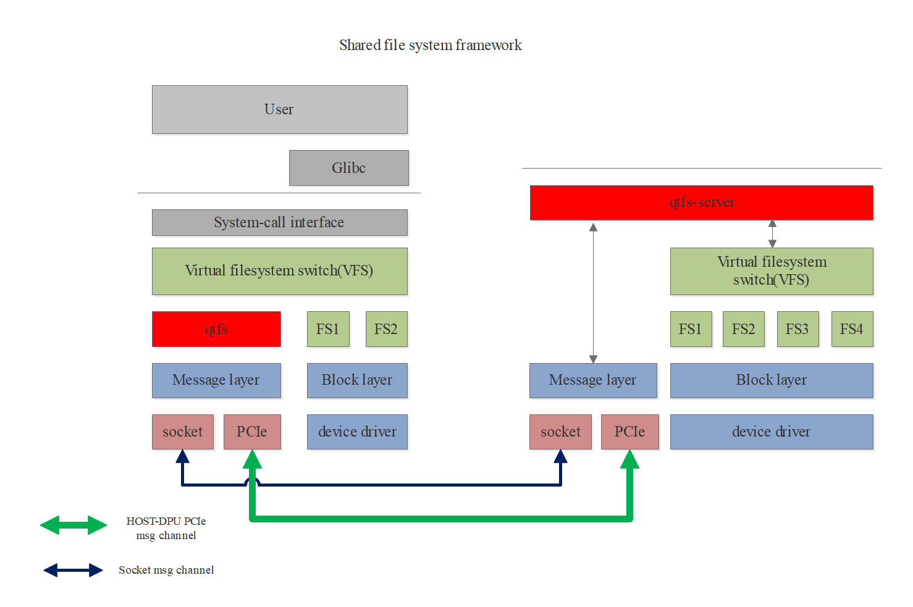

# qtfs

## 介绍

qtfs是一个共享文件系统项目，可部署在host-dpu的硬件架构上，也可以部署在2台服务器之间。它以客户端服务器的模式工作，使客户端能通过qtfs访问服务端的指定文件系统，得到本地文件访问一致的体验。

qtfs的特性：

+ 支持挂载点传播；

+ 支持proc、sys、cgroup等特殊文件系统的共享；

+ 支持远程文件读写的共享；

+ 支持在客户端对服务端的文件系统进行远程挂载；

+ 支持特殊文件的定制化处理；

+ 支持远端fifo、unix-socket等，并且支持epoll，使客户端和服务端像本地通信一样使用这些文件；

+ 支持基于host-dpu架构通过PCIe协议底层通信，性能大大优于网络；

+ 支持内核模块形式开发，无需对内核进行侵入式修改。

## 软件架构

软件大体框架图：



## 安装教程

目录说明：

+ **rexec**：跨主机二进制生命周期管理组件，在该目录下编译rexec和rexec_server。

+ **ipc**: 跨主机unix domain socket协同组件，在该目录下编译udsproxyd二进制和libudsproxy.so库。

+ **qtfs**： 客户端内核模块相关代码，直接在该目录下编译客户端ko。

+ **qtfs_server**： 服务端内核模块相关代码，直接在该目录下编译服务端ko和相关程序。

+ **qtinfo**：诊断工具，支持查询文件系统的工作状态以及修改log级别等。

+ **demo**、**test**、**doc**：测试程序、演示程序以及项目资料等。

+ 根目录： 客户端与服务端通用的公共模块代码。

### VSOCK通信模式

如有DPU硬件支持通过vsock与host通信，可选择此方法。

如果没有硬件，也可以选择host-vm作为qtfs的client与server进行模拟测试，通信通道为vsock：

启动vm时为vm配置vsock通道，vm可参考如下配置，增加vsock段置：

```
	<devices>
	  ...
	  <vsock model='virtio'>
	    <cid auto='no' address='10'/>
	    <alias name='vsock0'/>
	    <address type='pci' domain='0x0000' bus='0x05' slot='0x00' function='0x0'/>
	  </vsock>
	  ...
    </devices>
```

其他依赖：

    1. 要求内核版本在5.10或更高版本。

    2. 安装内核开发包：yum install kernel-devel json-c-devel。

服务端编译安装：

```bash
    1. cd qtfs_server
    2. make clean && make -j
    3. insmod qtfs_server.ko qtfs_server_vsock_cid=2 qtfs_server_vsock_port=12345 qtfs_log_level=WARN
    4. 配置白名单，将qtfs/config/qtfs/whitelist文件拷贝至/etc/qtfs/下，请手动配置需要的白名单选项，至少需要配置一个Mount白名单才能启动后续服务，任何文件或目录的增删改查操作都需要在白名单中增加对应权限才能正常工作。
    Tips: whitelist文件可从https://gitee.com/openeuler/dpu-utilities/blob/master/qtfs/config/qtfs/whitelist获取
    5. nohup ./engine 16 1 2 12121 10 12121 2>&1 &
    6. engine参数解释：engine ${number_of_threads} ${uds_proxy_thread_number} ${server_cid_or_ip} ${server_uds_proxy_port} ${client_cid_or_ip} ${client_uds_proxy_port}
    Tips: 这里的cid需要根据配置决定，如果host作为server端，则cid固定配置为2，如果vm作为server端，则需要配置为前面xml中的cid字段，本例中为10。
```

客户端安装：

```bash
    1. cd qtfs
    2. make clean && make -j
    3. insmod qtfs.ko qtfs_server_vsock_cid=2 qtfs_server_vsock_port=12345 qtfs_log_level=WARN
    4. cd ../ipc/
    5. make clean && make && make install
    6. nohup udsproxyd 1 10 12121 2 12121 2>&1 &
    7. udsproxyd参数解释：udsproxyd ${uds_proxy_thread_number} ${client_cid_or_ip} ${client_uds_proxy_port} ${server_cid_or_ip} ${server_uds_proxy_port}
    Tips：这里插入ko的cid和port配置为与server端一致即可，udsproxyd的cid + port与server端交换位置。
```

其他注意事项：

    1. udsproxyd目前也支持vsock和测试模式两种，使用vsock模式时，不能带UDS_TEST_MODE=1进行编译。
    2. 如果vsock不通，需要检查host是否插入了vhost_vsock内核模块：modprobe vhost_vsock。

### 测试模式 - 网络通信通道

首先找两台服务器（或虚拟机）配置内核编译环境：

1. 要求内核版本在5.10或更高版本。
2. 安装内核开发包：yum install kernel-devel。
3. 假设host服务器ip为192.168.10.10，dpu为192.168.10.11。

服务端安装：

```bash
    1. cd qtfs_server
    2. make clean && make -j QTFS_TEST_MODE=1
    3. 指定测试服务端的ip，ip a a ip_server(例：192.168.10.10)/port dev network（例:ens32），防止机器重启造成的ip变更问题，方便测试
    4. insmod qtfs_server.ko qtfs_server_ip=x.x.x.x qtfs_server_port=12345 qtfs_log_level=WARN
    5. 配置白名单，将qtfs/config/qtfs/whitelist文件拷贝至/etc/qtfs/下，请手动配置需要的白名单选项，至少需要配置一个Mount白名单才能启动后续服务。任何文件或目录的增删改查操作都需要在白名单中增加对应权限才能正常工作。
    Tips: whitelist文件可从https://gitee.com/openeuler/dpu-utilities/blob/master/qtfs/config/qtfs/whitelist获取
    6. nohup ./engine 16 1 192.168.10.10 12121 192.168.10.11 12121 2>&1 &
    7. engine参数解释：engine ${number_of_threads} ${uds_proxy_thread_number} ${server_cid_or_ip} ${server_uds_proxy_port} ${client_cid_or_ip} ${client_uds_proxy_port}
```

    Tips: 该模式暴露网络端口，有可能造成安全隐患，仅能用于功能验证测试，勿用于实际生产环境。

客户端安装：

```bash
    1. cd qtfs
    2. make clean && make -j QTFS_TEST_MODE=1
    3. 指定测试用户端的ip，ip a a ip_client(例：192.168.10.11)/port dev network（例:ens32），防止机器重启造成的ip变更问题，方便测试
    3. insmod qtfs.ko qtfs_server_ip=x.x.x.x qtfs_server_port=12345 qtfs_log_level=WARN
    4. cd ../ipc/
    5. make clean && make UDS_TEST_MODE=1 && make install
    6. nohup udsproxyd 1 192.168.10.11 12121 192.168.10.10 12121 2>&1 &
    7. udsproxyd参数解释：udsproxyd ${uds_proxy_thread_number} ${client_cid_or_ip} ${client_uds_proxy_port} ${server_cid_or_ip} ${server_uds_proxy_port}
	Tips：这里插入ko的cid和port配置为与server端一致即可，udsproxyd的cid + port与server端交换位置。
```

    Tips: 该模式暴露网络端口，有可能造成安全隐患，仅能用于功能验证测试，勿用于实际生产环境。

## 使用说明

安装完成后，客户端通过挂载把服务端的文件系统让客户端可见，例如：

```bash
    mount -t qtfs / /root/mnt/
```

客户端进入"/root/mnt"后便可查看到server端/目录下的所有文件，以及对其进行相关操作。此操作受到白名单的控制，需要挂载路径在server端白名单的Mount列表，或者在其子目录下，且后续的查看或读写操作都需要开放对应的白名单项才能进行。

Tips：若完成测试环境的配置后，无法通过客户端访问所挂载的客户端文件，可检查是否由防火墙的阻断导致。

## qtfs查询及控制工具

源码qtinfo目录下提供了qtfs的查询及控制工具qtinfo和qtcfg，该工具的编译过程如下：

```bash
1. cd qtfs/qtinfo

2. make role=client 或 make role=server，其中role按照当前节点属性进行设置
```

编译完成后生成qtinfo和qtcfg二进制，可以通过不加任何参数执行该二进制查看其用法。

## rexec使用

1. rexec工具依赖上述udsproxyd服务，使用udsproxyd提供的uds协同进行通信，请确认udsproxyd正常启动。

2. 为rexec_server配置白名单，将qtfs/config/rexec/whitelist文件拷贝至/etc/rexec/下，请手动配置需要的白名单选项，在其中增加允许执行的二进制命令，请注意该白名单应该配置在rexec_server运行的系统上，如果双向运行，则两侧都需要配置，rexec_server服务只接受该白名单列出的二进制拉起执行，不在白名单中的请求会被rexec_server拒绝拉起。

3. 为rexec端配置uds白名单（这个白名单只在需要调用rexec二进制的系统中配置，如果是双向则都配置），在udsconnect中增加rexec通信socket所在目录白名单，增加方式有两种：

    1. 在qtfs_server端可以将/etc/qtfs/whitelist的`[udsconnect]`表项中增加`/var/run/rexec`，修改后需要重新启动engine进程使其生效。

    2. 使用前述的qtcfg进行配置：`qtcfg -w udsconnect -x /var/run/rexec`，配置完成后可通过`qtcfg -w udsconnect -z`查询是否生效。qtcfg可以在qtfs client或者server端动态添加白名单，qtfs server端应该在engine拉起后执行。

4. 拉起rexec_server作为服务端，无需参数

5. 通过rexec ${your_cmd} 验证rexec功能是否正常

Tips：rexec的远程执行功能支持双向，需要在client和server都拉起rexec_server服务。

## 无感卸载场景

qtfs可用于DPU管理面无感卸载场景，通过qtfs为卸载进程准备运行时工作目录、系统工作目录，并为卸载后管理进程与主机侧业务进程提供透明的本地通信接口。

qtfs提供的协同文件系统、协同IPC等能力尽可能做到系统通用，管理软件仍需要进行少量适配工作。相比通过拆分方案进行管理软件卸载，qtfs提供的无感卸载可以大幅降低业务修改适配的工作量（可将代码修改控制在几百行，拆分方案代码修改可达千行甚至万行级别）。

通过这种方案可大幅提升管理面卸载的兼容性，方便后续版本升级；另外该方案具备一定通用性，可适配虚拟化管理面卸载和容器管理面卸载等场景。

Note：不同场景管理面进程使用qtfs进行无感卸载时，仍需要进行代码适配，用户需要具备场景专业知识，对管理代码工具进行适配，并使用合适的qtfs配置。

本文档后续章节介绍两个管理面工具无感卸载的推荐场景：[虚拟化管理面DPU无感卸载](libvirt直连聚合环境搭建.md)及[容器管理面DPU无感卸载](./容器管理面直连聚合环境搭建.md)。

NOTE：上述无感卸载指导文档中提供的libvirt及docker适配patch仅供参考，不可用于商用环境；用户应基于自己的实际场景进行对应代码修改适配。
