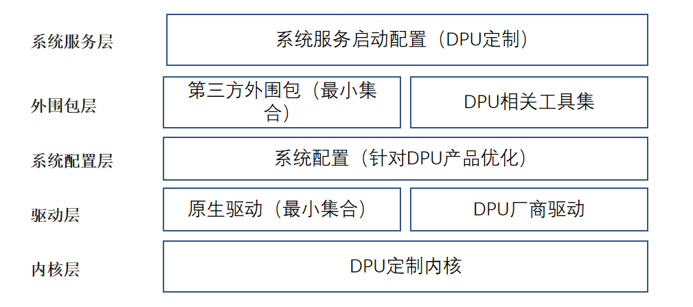

# 基于openEuler的DPU-OS裁剪发布

在数据中心及云场景下，摩尔定律失效，通用处理单元CPU算力增长速率放缓，而网络IO类速率及性能不断攀升，二者增长速率差异形成剪刀差，即当前通用处理器的处理能力无法跟上网络、磁盘等IO处理的需求。传统数据中心下越来越多的通用CPU算力被IO及管理面等处理占用，这部分资源损耗称之为数据中心税（Datacenter Tax）。据AWS统计，数据中心税可能占据数据中心算力的30%以上，部分场景下甚至可能更多。

DPU (Data Processing Unit) 的出现就是为了将这部分算力资源从主机CPU上解放出来，通过将管理面、网络、存储、安全等能力卸载到专有的处理器芯片上进行处理加速，达成降本增效的结果。目前主流云厂商如AWS、阿里云、华为云都通过自研芯片完成管理面及相关数据面的卸载，实现数据中心计算资源100%售卖给客户。

目前DPU发展非常火热，云厂商及大数据在相关场景下对DPU存在较强烈的需求，国内也有很多DPU初创公司推出不同的DPU产品。在这一背景下，云和大数据等厂商需要考虑如何整合使用不同DPU产品，而DPU厂商也面临对不同客户交付时设备驱动适配客户指定操作系统的问题。openEuler作为国内领先的开源开放操作系统，通过基于openEuler构建的DPU-OS，解决DPU厂商及客户之间的适配问题。另外DPU上OS用于承载部分业务加速的需求，需要对DPU-OS进行性能优化加速，可以基于openEuler构建DPU相关加速能力，内置在DPU-OS中，构建DPU相关软件生态。

## DPU-OS需求及设计

#### DPU现状及对OS需求

DPU普遍具有以下特点和问题：

* DPU通用处理能力资源受限

  当前DPU仍处在发展早期阶段，硬件上仍在不断演进，而且由于DPU供电限制，当前硬件规格普遍较低。主流DPU中通用处理器CPU核数较少，约8-24CPU，且单核处理能力弱。内存大小受限，普遍在16-32GB。DPU本地存储空间为几十到几百GB不等。运行于DPU之上的操作系统也需要考虑这些限制。

* DPU-OS安装方式多样

  当前DPU厂商及产品多种多样，对应操作系统的安装部署方式也不尽相同，包括PXE网络安装、U盘安装或其他自定义安装方式（由HOST下发安装镜像）。

* DPU性能需求

  DPU的应用场景决定其对性能有强烈需求，相比于通用服务器操作系统，DPU-OS可能对内核特性或功能组件有特殊要求，比如用于设备直通热迁移的vDPA特性、厂商特定驱动适配支持、DPU进程的无感卸载特性、定制优化的用户态数据面加速工具如DPDK/SPDK/OVS、DPU管理监控相关的工具类组件。

针对以上DPU现状，提出对DPU-OS的需求如下：

* 极致轻量的DPU-OS安装包

  通过裁剪openEuler系统镜像，减少非必要安装包的空间占用；通过优化系统服务，减少资源底噪开销。

* 裁剪配置及工具支持

  提供裁剪配置及裁剪工具支持，客户或DPU厂商可根据各自需求进行定制；openEuler提供ISO参考实现。

* 定制化内核及系统，提供极致性能

  通过定制内核及相关驱动，提供DPU竞争力内核特性；定制化加速类组件，使能DPU硬件加速能力；优化系统配置提供更优性能；通过DPU相关管理控制工具，方便用户统一管理。

#### DPU-OS设计

**图1**DPU-OS整体设计



如图1所示，DPU-OS分为五层设计：

* 内核层：通过定制内核config，裁剪非必需内核特性及模块，达成内核轻量级效果；使能特定内核特性提供高性能DPU内核能力。

* 驱动层：对openEuler原生驱动进行裁剪定制，选择最小集合；DPU厂商相关底层驱动集成，原生支持部分DPU硬件产品。

* 系统配置层：通过对系统sysctl、proc进行配置，为DPU相关业务提供最优性能。

* 外围包层：对openEuler外围包进行裁剪定制，选择最小集合；提供DPU相关的定制工具集合。

* 系统服务层：通过优化系统原生服务启动项，减少非必要系统服务运行，保证系统运行时底噪最小化。

通过上述五层设计达成轻量化、极致性能DPU-OS的目标。该方案为相对长期设计，且对DPU相关软硬件生态有较强的依赖；当前第一阶段先实现基于openEuler imageTailor进行裁剪。

DPU-OS的裁剪步骤可参考后续章节[DPU-OS裁剪指导](#DPU-OS裁剪指导)，验证与部署可参考[DPU-OS部署验证](#验证与部署)。

> **说明**：
>
> 当前阶段DPU-OS先基于openEuler现有内核及外围包，使用镜像裁剪工具imageTailor进行裁剪，提供轻量化OS安装镜像。后续可根据实际诉求，进行相关内核及外围包特性的开发及集成。

## DPU-OS裁剪

本节主要介绍`imageTailor`的使用方法并结合[dpu-utilities仓库](https://gitee.com/openeuler/dpu-utilities/tree/master/dpuos)的`dpuos`配置文件裁剪得到`dpuos`的安装镜像，具体步骤如下：

#### 准备imageTailor和所需的rpm包

参照[imageTailor使用指导文档](https://docs.openeuler.org/zh/docs/22.03_LTS/docs/TailorCustom/imageTailor%E4%BD%BF%E7%94%A8%E6%8C%87%E5%8D%97.html)安装好`imageTailor`工具并将裁剪所要用到的rpm包准备好。

可以使用openEuler提供安装镜像作为镜像裁剪所需要rpm包源，`openEuler-22.03-LTS-everything-debug-aarch64-dvd.iso`中的rpm比较全但是此镜像很大，可以用镜像`openEuler-22.03-LTS-aarch64-dvd.iso`中的rpm包和一个`install-scripts.noarch`实现。

> **说明**：上述openEuler ISO镜像可按需替换为指定版本

`install-scripts.noarch`包括可以从everything包中获取，或者在系统中通过yum下载：

```bash
yum install -y --downloadonly --downloaddir=./ install-scripts
```

#### 拷贝dpuos相关的配置文件

`imageTailor`工具默认安装在`/opt/imageTailor`路径下。执行下面的命令将`dpuos`的配置拷贝到对应的路径下，拷贝时选择对应架构目录。当前DPU-OS裁剪配置库支持x86_64和aarch64两种架构。

```bash
cp -rf custom/cfg_dpuos /opt/imageTailor/custom
cp -rf kiwi/minios/cfg_dpuos /opt/imageTailor/kiwi/minios/cfg_dpuos
```

#### 修改其他配置文件

* 修改`kiwi/eulerkiwi/product.conf`，增加一行`dpuos`相关配置:

```
dpuos           PANGEA        EMBEDDED   DISK     GRUB2        install_mode=install install_media=CD install_repo=CD selinux=0
```

* 修改`kiwi/eulerkiwi/minios.conf`，增加一行`dpuos`的相关配置:

```
dpuos      kiwi/minios/cfg_dpuos yes
```

* 修改`repos/RepositoryRule.conf`，增加一行`dpuos`的相关配置:

```
dpuos          1           rpm-dir     euler_base
```

#### 设置密码

进入到`/opt/imageTailor`子目录下，修改下面3个文件的密码:

* `custom/cfg_dpuos/usr_file/etc/default/grub`

* `custom/cfg_dpuos/rpm.conf`

* `kiwi/minios/cfg_dpuos/rpm.conf`

密码生成及修改方法可详见openEuler imageTailor手册[配置初始密码](https://docs.openeuler.org/zh/docs/22.03_LTS/docs/TailorCustom/imageTailor%E4%BD%BF%E7%94%A8%E6%8C%87%E5%8D%97.html#%E9%85%8D%E7%BD%AE%E5%88%9D%E5%A7%8B%E5%AF%86%E7%A0%81)章节。

#### 执行裁剪命令

执行下面的命令进行裁剪，最后裁剪出来的ISO在`/opt/imageTailor/result`路径下：

```bash
cd /opt/imageTailor
./mkdliso -p dpuos -c custom/cfg_dpuos --sec --minios force
```

## 验证与部署

DPU-OS制作完成后可以在实际DPU硬件进行验证部署，也可以通过VirtualBox拉起虚拟机进行验证。本节介绍虚拟机验证步骤：

#### 验证准备

在开始部署 DPU-OS 之前,需要做如下准备工作:

- 获取 DPU-OS ISO
- 安装有VirtualBox的宿主机

#### 初步安装与启动

##### 创建虚拟机

通过VirtualBox创建新的虚拟机：

- 选择虚拟机配置，CPU及内存建议2CPU+4GB内存以上

- 创建虚拟机磁盘，磁盘大小建议60GB以上

- 系统扩展属性部分，勾选启动EFI

- 存储设置部分，光驱配置选择本地DPU-OS ISO作为光驱文件

- 其他网络或显示设置可自定义

##### 启动虚拟机

启动新建的虚拟机，启动项选择`Install from ISO`进行DPU-OS安装，安装过程自动进行无需手动干预，安装完成后自动重启。

选择启动项 `Boot From Local Disk`，启动后即可进入DPU-OS。密码为DPU-OS制作时指定的密码。

通过上述步骤，即可完成DPU-OS的本地部署验证。
